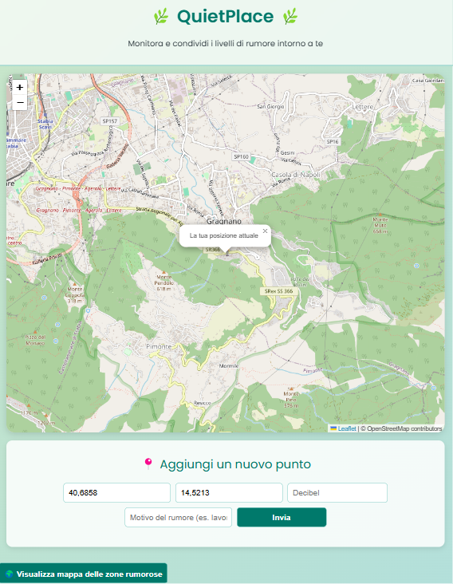
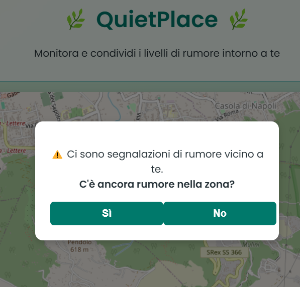
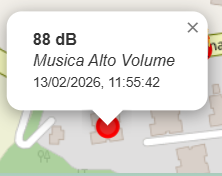
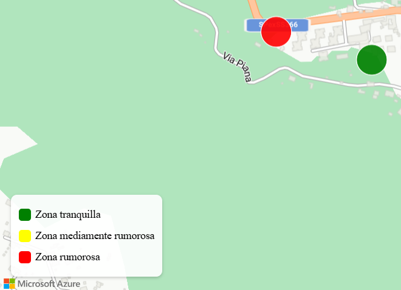

# QuietPlace

Progetto sviluppato per il corso di Cloud Computing.

**QuietPlace** è una web app cloud per il **monitoraggio collaborativo del rumore ambientale**: consente agli utenti di registrare segnalazioni geolocalizzate (dB + causa) su mappa, aggiornarle nel tempo tramite conferma e scadenza automatica, e consultare una **heatmap aggregata** per identificare rapidamente **aree più tranquille** e **zone critiche** per inquinamento acustico.

## Live Demo

**Web App**: https://mango-stone-006837203.1.azurestaticapps.net

---

## Funzionalità principali

- **Segnalazione rumore su mappa (OpenStreetMap)**  
  Nella Home viene caricata una mappa sulla quale:
  - L'utente può selezionare un punto sulla mappa e il form sottostante compila automaticamente:
    - latitudine (`lat`)
    - longitudine (`lon`)  
  - L’utente inserisce manualmente:
    - intensità del rumore in decibel (`decibel`)
    - motivo/causa del rumore (`reason`)  

  Dopo l’invio, il punto viene salvato nel backend e mostrato sulla mappa.

- **Marker colorati per intensità**
  
  I marker sono colorati in base all'intensità del rumore:
    - verde (per intensità inferiore ai 50db) 
    - giallo (per intensità compresa tra 51db e 80db)
    - rosso (per intensità superiore a 80db)

- **Conferma presenza rumore tramite geolocalizzazione**
  
  Al refresh della Home, se l’utente si trova nei pressi di una segnalazione, l’app chiede se il rumore esiste ancora:
    - se **Sì** → la segnalazione resta attiva e viene aggiornato il timestamp
    - se **No** → viene archiviata nello storico e rimossa dalla mappa

- **Scadenza automatica dopo 24 ore**
  
  Le segnalazioni attive vengono automaticamente spostate nello storico una volta trascorse 24 ore.

- **Heatmap delle zone rumorose (Azure Maps)**
  
  Una pagina dedicata mostra una heatmap basata su un file `zones.json` generato automaticamente ogni notte analizzando lo storico.

---

## Screenshot / Demo

  
  
  
  

---

## Servizi utilizzati

- **Frontend**
  - **Azure Static Web Apps** per l’hosting della web app.

- **Backend**
  - **Azure Functions**(Node.js) con HTTP Trigger e Timer Trigger.

- **Storage**
  - **Azure Storage Account + Blob Storage** per la persistenza dei punti di rumore e del file di aggregazione `zones.json`.

- **Mappe / Visualizzazione heatmap**
  - **Azure Maps** per la pagina heatmap.
  - Autenticazione tramite **token generato dal backend** (no key nel client).

---

## Blob Containers (Azure Storage Account)

- `quietplace-data`  
  Contiene i **punti attivi** (visibili sulla mappa nella Home).

- `quietplace-history`  
  Contiene i punti **archiviati**, cioè:
  - disattivati manualmente dall’utente
  - scaduti automaticamente dopo 24 ore

- `quietplace-zones`  
  Contiene il file `zones.json` generato dalla funzione Timer Trigger (analyzeNoiseZones).

---

## Architettura

**Flusso logico:**
1. Home (mappa + form) → Inserimento Punti di Rumore → Salvataggio in `quietplace-data`
2. Conferma utente / Scadenza dopo 24h → Archiviazione punti di rumore → `quietplace-history`
3. Job notturno → Analisi Storico → Generazione file JSON `quietplace-zones/zones.json`
4. Pagina Heatmap → Carica il file JSON `zones.json` e lo renderizza su Azure Maps

---

## API / Endpoints (HTTP Trigger)

- `POST /api/submitNoise` → Inserimento Segnalazione di Rumore
- `GET  /api/points` → Restituisce i punti attivi (GeoJSON)
- `POST /api/updatePointStatus` → Conferma “esiste ancora?” / disattiva punto
- `GET  /api/zones` → Restituisce il file `zones.json`
- `GET  /api/getAzureMapsToken` → Restituisce un token per Azure Maps (sicurezza)

---

## Job schedulati (Timer Trigger)
- cleanupOldPoints → eseguita periodicamente (ogni ora) per scadenza a 24h
- analyzeNoiseZones → eseguita ogni notte (03:00 UTC) per generare zones.json

## Funzioni Azure 

### 1) submitNoise (HTTP Trigger)
**Scopo:** Inserimento di un nuovo punto di rumore.  
**Input:** `lat`, `lon`, `decibel`, `reason`.  
**Output:** Conferma Inserimento.

**Cosa fa:**
1. Valida i parametri ricevuti dal form
2. Calcola colore (verde/giallo/rosso) in base ai dB
3. Genera un `id` univoco e un `timestamp`
4. Salva un blob JSON nel container `quietplace-data`

---

### 2) points / listNoise (HTTP Trigger)
**Scopo:** fornire al frontend tutti i **punti attivi** per disegnarli sulla mappa.  
**Output:** GeoJSON (FeatureCollection).

**Cosa fa:**
1. Legge i blob JSON presenti in `quietplace-data`
2. Costruisce un GeoJSON con proprietà utili (id, color, decibel, reason, timestamp)
3. Restituisce il GeoJSON al client

---

### 3) updatePointStatus (HTTP Trigger)
**Scopo:** Gestire la domanda “il rumore esiste ancora?” (conferma/disattivazione).

**Input tipico:** `id` + `action`  
- `action = "refresh"` → conferma che il rumore esiste ancora  
- `action = "inactive"` → conferma che il rumore non esiste più

**Cosa fa:**
- **refresh**
  1. Aggiorna timestamp / stato del punto
  2. Mantiene il blob in `quietplace-data`

- **inactive**
  1. Copia il blob dal container `quietplace-data` al container `quietplace-history`
  2. Elimina il blob da `quietplace-data`

---

### 4) cleanupOldPoints (Timer Trigger)
**Scopo:** Scadenza automatica dei punti dopo 24 ore dall'inserimento o conferma.

**Schedule:** Ogni ora.  
**Cosa fa:**
1. Legge i punti attivi da `quietplace-data`
2. Calcola da quanto tempo esistono (timestamp)
3. Se > 24 ore:
   - Copia in `quietplace-history`
   - Elimina da `quietplace-data`

---

### 5) analyzeNoiseZones (Timer Trigger)
**Scopo:** Generare la heatmap aggregata a partire dallo storico.

**Schedule:** Ogni notte alle **03:00 UTC** (≈ 04:00 in Italia).  
**Cosa fa:**
1. Legge tutti i record in `quietplace-history`
2. Raggruppa i punti in celle geografiche (grid) per calcolare:
   - Numero di segnalazioni per cella (`count`)
   - Livello medio / Categoria colore
3. Produce un GeoJSON aggregato (zone/celle)
4. Salva il risultato come `quietplace-zones/zones.json`

---

### 6) zones (HTTP Trigger)
**Scopo:** Fornire al frontend il file `zones.json`.  
**Cosa fa:**
1. Legge `quietplace-zones/zones.json`
2. Lo restituisce come JSON al client (pagina heatmap)

---

### 7) getAzureMapsToken (HTTP Trigger)
**Scopo:** Autenticare la pagina Heatmap su Azure Maps senza esporre segreti nel client e nella git history.

**Cosa fa:**
1. Usa credenziali configurate via **variabili d’ambiente** nella Function App
2. Richiede un token a **Microsoft Entra ID**
3. Restituisce al client un token testuale (usato dall’SDK di Azure Maps tramite `getToken()`)

> Questo approccio evita di committare o esporre la subscription key nel frontend.

---

## Guida all’utilizzo

### Web App (utente)
1. Aprire: https://mango-stone-006837203.1.azurestaticapps.net
2. Nella Home si può cliccare un punto sulla mappa per impostare `lat/lon` o abilitare la geolocalizzazione
3. Inserimento `decibel` e `motivo`, poi invio della segnalazione
4. Attendere che il marker compaia sulla mappa con colore coerente
5. Se l'utente è  vicino a una segnalazione, si può confermare il rumore cliccando su "SI" oppure eliminarlo cliccando su "NO"
6. Al click su un punto di rumore vengono visualizzati i dettagli (Intensità, Motivo, Data Inserimento e Orario)
7. Se viene premuto il bottone "Visualizza mappa delle zone rumorose" si visualizzano le zone rumorose aggregate basate sullo storico delle segnalazioni

---

## Autore

- Lorenzo Lucio Ruocco
